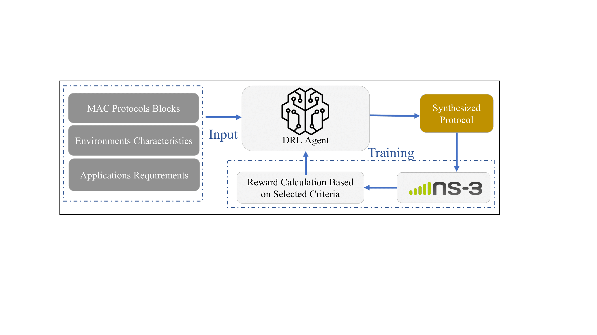

# ML-Framework-for-NR-U-MAC-Protocol-Design-Multi-Agent #

## Introduction

This repository introduces a cutting-edge Multi-Agent Deep Reinforcement Learning (MADRL) framework for designing MAC protocols for the 5G NR-U (New Radio - Unlicensed). Unlike traditional centralized approaches that depend on a single decision-making entity, our framework enables individual network nodes to autonomously learn and optimize their MAC behaviors based on local observations. This module provides a foundation for distributed multi-agent learning, empowering researchers and developers to design adaptive MAC protocols tailored to dynamic environmental conditions. A detailed description of this module can be found in [this paper](https://ieeexplore.ieee.org/document/10758702). 

<p align="center">
    
</p>

## Main Features

- Enables seamless data exchange between state-of-the-art Multi-Agent reinforcement learning framework Ray RLlib and ns-3
- Supports the simulation of NR-U and its LBT channel access mechanism
- Facilitates custom configuration of PHY and MAC layer parameters in the NR-U for specific channel and traffic conditions (e.g. minimum contention window, slot time, defer time, TX power, etc.)
- Enables the training of a tailor-made MAC protocol across different RL scenario, viz. CTCE (Centralized Training Centralized Execution), CTDE (Centralized Training Distributed Execution), and DTDE (Distributed Training Distributed Execution)

## Installation

Check out [install.md](./docs/install.md) for how to install and setup the NR-AI-MAC module.

## Usage example

You can use the following command to run the training and evaluation with NR-AI-MAC module in different scenarios

1. Training the PPO model for different scenarios

a. CTCE scenario

```bash
cd contrib/ai/examples/nr-ai-mac/use-gym
python3 run_nr_mac.py --agent central
```

b. CTDE scenario

```bash
cd contrib/ai/examples/nr-ai-mac/use-gym
python3 run_nr_mac.py --agent multi
```

c. DTDE scenario

```bash
cd contrib/ai/examples/nr-ai-mac/use-gym
python3 run_nr_mac.py --agent multi --separate_agent_nns
```

2. Inserting trained policies for evaluation 

a. CTCE scenario

```bash
cd contrib/ai/examples/nr-ai-mac/use-gym
python3 evaluation.py --agent central --outputDir "YOUR_OUTPUT_DIR" --rllibDir "YOUR_RAY_CHECKPOINT"
```

b. CTDE scenario

```bash
cd contrib/ai/examples/nr-ai-mac/use-gym
python3 evaluation.py --agent multi --outputDir "YOUR_OUTPUT_DIR" --rllibDir "YOUR_RAY_CHECKPOINT"
```

c. DTDE scenario

```bash
cd contrib/ai/examples/nr-ai-mac/use-gym
python3 evaluation.py --agent multi --separate_agent_nns --outputDir "YOUR_OUTPUT_DIR" --rllibDir "YOUR_RAY_CHECKPOINT"
```

Note : "YOUR_RAY_CHECKPOINT" is by default saved in home/user/ray_results/, e.g. home/user/ray_results/PPO_2024-08-05_23-22-17

3. Debugging possible errors 

a. ns3-ai environemnt path in [environments.py](./contrib/ai/examples/nr-ai-mac/use-gym/environments.py) sometimes needs to be defined explicitly

```bash
self.dummyEnv = Ns3Env(targetName="ns3ai_nrmac_gym",
            ns3Path="YOUR_NS3_PATH", ns3Settings=ns3Settings, envNumber = self.envNumber)
```
            
b. The path to pathloss matrix in [nr-ai-mac.cc](./contrib/ai/examples/nr-ai-mac/use-gym/nr-ai-mac.cc) sometimes need to be defined explicitly

```bash
std::string pathlossDir = "YOUR_NS3_PATH/freespacePL/";
```

<!--
## Documentation
 
The documentation of this module is available at 
-->

## Related modules

In order to implement the NR-AI-MAC module, we make use and modify the following sub-modules :

- nr-u is an ns-3 module for for the simulation of NR-U non-standalone cellular networks. Check [nr-u](https://gitlab.com/cttc-lena/nr-u) for further details.
- ns3-ai is an ns-3 module to enable interaction between ns-3 and Python scripts. Check [ns3-ai](https://github.com/hust-diangroup/ns3-ai) for further details.
- ns-3-vr-app is an implementation of a traffic model for AR/VR applications on ns-3. Check [ns-3-vr-app](https://github.com/signetlabdei/ns-3-vr-app) for further details.

## References 
If you use this module in your research, please cite:

N. Keshtiarast, O. Renaldi and M. Petrova, "Wireless MAC Protocol Synthesis and Optimization With Multi-Agent Distributed Reinforcement Learning," in IEEE Networking Letters, doi: 10.1109/LNET.2024.3503289.  [Bibtex available here](https://ieeexplore.ieee.org/document/10758702) 

## Future work
We are actively developing new features integrating reinforment learning to ns-3, including:
- WIFI-AI-MAC : Multi-Agent Deep Reinforcement Learning (MADRL) framework for MAC protocol design for Wi-Fi
- COEX-AI-MAC : Multi-Agent Deep Reinforcement Learning (MADRL) framework for MAC protocol design for the coexistance between Wi-Fi and NR-U

<!-- 
## About
This module is being developed by .
This  work  was  supported  .
-->

<!-- 
## Authors ##

The NR-AI-MAC module is the result of the development effort carried out by different people. The main contributors are: 
-->

## License ##

This software is licensed under the terms of the GNU GPLv2, as like as ns-3. See the LICENSE file for more details.
